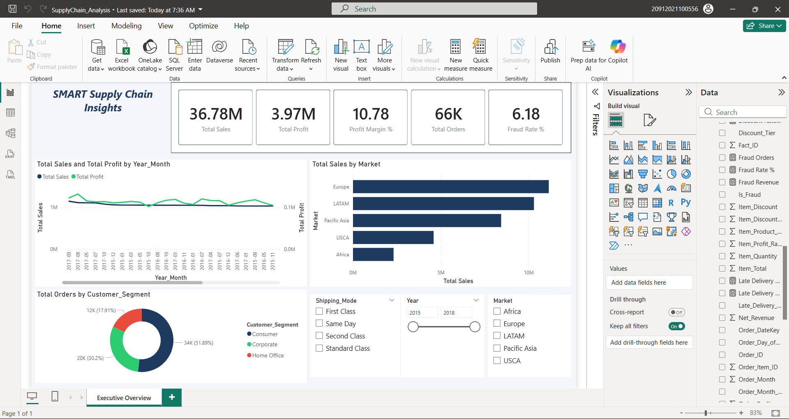
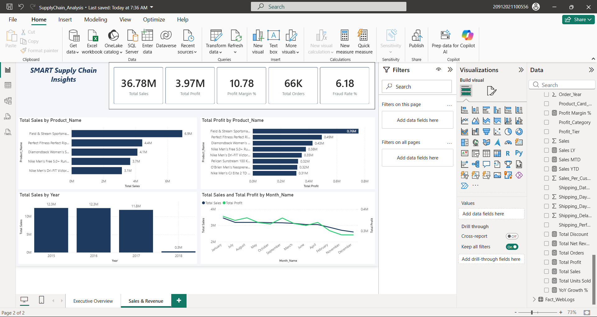
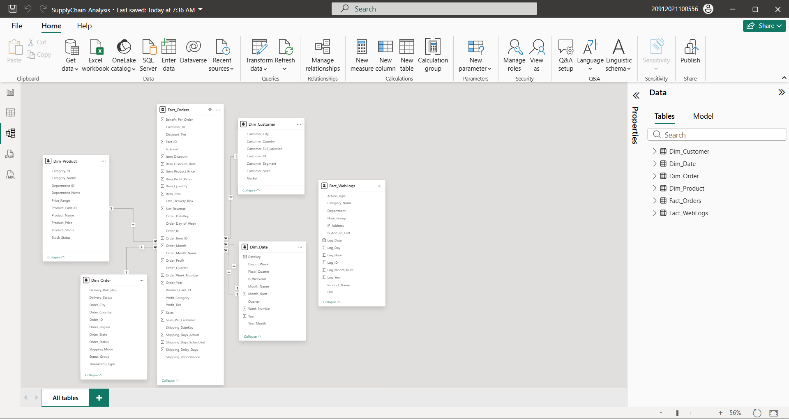

# SMART Supply Chain Insights Dashboard

> End-to-end Supply Chain Analytics project: Python data pipeline → SQL Server Star Schema → Power BI executive dashboard with 60+ DAX measures.

---

## Dashboard Preview

### Executive Overview


### Sales & Revenue Analysis


### Power BI Data Model


### Star Schema Relationships


---

## Architecture

```
Raw Data (CSV 180K rows + 1.7M Web Logs)
        │
        ▼
┌───────────────────┐
│  clean_and_merge  │  Python · pandas
│  .py              │  Encoding fix, feature engineering,
│                   │  Star Schema table splits
└────────┬──────────┘
         │  SupplyChain_Cleaned_Master.xlsx
         ▼
┌───────────────────┐
│ load_to_sqlserver │  pyodbc · SQLAlchemy
│ .py               │  Bulk-insert 6 tables into
│                   │  SQL Server (SupplyChainDW)
└────────┬──────────┘
         │  ODBC connection
         ▼
┌─────────────────────────────────────┐
│         SQL Server SupplyChainDW    │
│                                     │
│  Dim_Date ──────┐                   │
│  Dim_Customer ──┤                   │
│  Dim_Product ───┼──► Fact_Orders    │
│  Dim_Order ─────┘                   │
│  Web_Access_Logs (standalone)       │
└────────┬────────────────────────────┘
         │  DirectQuery / Import
         ▼
┌───────────────────┐
│   Power BI        │  60+ DAX measures
│   Dashboard       │  4 report pages
│                   │  Navy / Green theme
└───────────────────┘
```

---

## Repository Structure

```
SMART-Supply-Chain-Insights-Dashboard/
│
├── python/
│   ├── clean_and_merge.py          # Data cleaning + Star Schema split
│   ├── load_to_sqlserver.py        # Bulk-load Excel → SQL Server
│   └── EDA_SupplyChain_Report.py   # 19 EDA charts (PNG output)
│
├── sql/
│   └── SupplyChain_StarSchema.sql  # DDL + Star Schema + indexes
│
├── powerbi/
│   ├── DAX_Measures_60plus.txt     # All 60+ DAX measures
│   └── PowerBI_Guide_Step_by_Step.txt  # Full dashboard build guide
│
└── images/
    ├── dashboard_executive.png
    ├── dashboard_sales.png
    ├── powerbi_model.png
    └── powerbi_relationships.png
```

---

## Technology Stack

| Layer | Tool |
|---|---|
| Data Cleaning | Python 3.11, pandas, numpy, openpyxl |
| Database | SQL Server (LocalDB / SSMS), pyodbc, SQLAlchemy |
| Visualization | Power BI Desktop |
| Version Control | Git / GitHub |

---

## Dataset

| File | Rows | Description |
|---|---|---|
| DataCoSupplyChainDataset.csv | 180,519 | Orders, products, customers, shipping |
| tokenized_access_logs.csv | ~1.7M | Web clickstream logs |
| DescriptionDataCoSupplyChain.csv | 53 | Data dictionary |

Source: DataCo Smart Supply Chain dataset (Kaggle)

---

## Star Schema Design

```
                    ┌──────────────┐
                    │  Dim_Date    │
                    │  DateKey PK  │
                    └──────┬───────┘
                           │
┌──────────────┐    ┌──────┴───────────────────┐    ┌──────────────┐
│ Dim_Customer │    │       Fact_Orders         │    │ Dim_Product  │
│ customer_id  │◄───│  order_id  (PK)           │───►│ product_card │
│ PK           │    │  customer_id  (FK)        │    │ _id  PK      │
└──────────────┘    │  product_card_id (FK)     │    └──────────────┘
                    │  order_date   (FK→Date)   │
                    │  sales, profit, qty, …    │
                    └──────────┬────────────────┘
                               │
                    ┌──────────┴───────┐
                    │   Dim_Order      │
                    │   order_id PK    │
                    └──────────────────┘
```

**6 Tables Loaded into SQL Server:**

| Table | Rows | Description |
|---|---|---|
| Fact_Orders | 180,519 | Sales metrics, KPIs, flags |
| Dim_Customer | 20,652 | Customer segments, geography |
| Dim_Product | 118 | Products, categories, price tiers |
| Dim_Order | 65,636 | Order status, shipping mode |
| Dim_Date | 1,461 | Calendar table 2015-2018 |
| Web_Access_Logs | 100,000 | Product views, add-to-cart |

---

## Key DAX Measures (60+)

### Sales & Revenue
```dax
Total Sales = SUM(Fact_Orders[sales])
Total Revenue = SUM(Fact_Orders[net_revenue])
Total Profit = SUM(Fact_Orders[order_profit_per_order])
Total Orders = DISTINCTCOUNT(Fact_Orders[order_id])
Total Quantity = SUM(Fact_Orders[order_item_quantity])
Avg Order Value = DIVIDE([Total Sales], [Total Orders])
```

### Profitability
```dax
Profit Margin % = DIVIDE([Total Profit], [Total Sales])
YoY Profit Growth = DIVIDE([Total Profit] - [LY Profit], [LY Profit])
Profit Per Customer = DIVIDE([Total Profit], DISTINCTCOUNT(Fact_Orders[customer_id]))
```

### Logistics & Risk
```dax
Late Delivery Rate = DIVIDE(
    CALCULATE(COUNTROWS(Fact_Orders), Fact_Orders[late_delivery_risk] = 1),
    [Total Orders]
)
Avg Shipping Delay = AVERAGE(Fact_Orders[shipping_delay_days])
Fraud Rate % = DIVIDE([Fraud Orders], [Total Orders])
Fraud Orders = CALCULATE(COUNTROWS(Fact_Orders), Fact_Orders[Is_Fraud] = 1)
```

### Time Intelligence
```dax
LY Sales = CALCULATE([Total Sales], SAMEPERIODLASTYEAR(Dim_Date[Date]))
YoY Sales Growth = DIVIDE([Total Sales] - [LY Sales], [LY Sales])
MTD Sales = CALCULATE([Total Sales], DATESMTD(Dim_Date[Date]))
QTD Sales = CALCULATE([Total Sales], DATESQTD(Dim_Date[Date]))
YTD Sales = CALCULATE([Total Sales], DATESYTD(Dim_Date[Date]))
3-Month Rolling Sales = CALCULATE([Total Sales], DATESINPERIOD(Dim_Date[Date], LASTDATE(Dim_Date[Date]), -3, MONTH))
```

*See `powerbi/DAX_Measures_60plus.txt` for all 60+ measures.*

---

## EDA Findings (19 Charts)

| Chart | Key Finding |
|---|---|
| EDA_01 Row Counts | 180K orders, 1.7M web logs |
| EDA_02 KPIs | $14.9M revenue, 12.7% margin, 54.8% late delivery |
| EDA_03 Monthly Trend | Q4 peak in 2016-2017, seasonal dips in Feb |
| EDA_04 Yearly Performance | Revenue flat 2015→2017; 2018 partial year |
| EDA_05 Market Performance | LATAM leads volume; Europe highest avg order |
| EDA_06 Customer Segments | Consumer 52% > Corporate 30% > Home Office 18% |
| EDA_07 RFM Analysis | 3 tiers: Champions, At-Risk, Dormant |
| EDA_08 Top Products | Top 10 products = 28% of total revenue |
| EDA_09 Departments | Fan Shop & Apparel dominate sales volume |
| EDA_10 Discount Impact | High discounts (>20%) correlate with lower profit margin |
| EDA_11 Shipping Mode | Standard Class 59%; First Class highest margin |
| EDA_12 Delivery Status | 54.8% late delivery risk flagged |
| EDA_13 Fraud Analysis | 1.9% suspected fraud rate |
| EDA_14 Geography | Top countries: USA, France, Mexico, Germany |
| EDA_15 Web Logs | Peak views 18-21h; Product pages dominate |
| EDA_16 Views vs Sales | Add-to-cart rate ~8%; strong view→purchase correlation |
| EDA_17 Correlation | Profit correlates with qty × price, not discount alone |
| EDA_18 Distributions | Sales right-skewed; most orders <$300 |
| EDA_19 Key Findings | Summary: risk, opportunity, fraud alert |

---

## Quick Start

### 1. Clone the Repository
```bash
git clone https://github.com/MohamedEl-sadek/SMART-Supply-Chain-Insights-Dashboard.git
cd SMART-Supply-Chain-Insights-Dashboard
```

### 2. Install Python Dependencies
```bash
pip install pandas numpy openpyxl pyodbc sqlalchemy matplotlib seaborn
```

### 3. Set Your Data Path
In each Python script, update:
```python
BASE_DIR = r"D:\SMART-Supply-Chain-Insights"
```

### 4. Run the Pipeline

```bash
# Step 1: Clean data and build Excel with 6 Star Schema sheets
python python/clean_and_merge.py

# Step 2: Load Excel into SQL Server
python python/load_to_sqlserver.py

# Step 3: Generate 19 EDA charts
python python/EDA_SupplyChain_Report.py
```

### 5. SQL Server Setup
```sql
-- Run in SSMS to verify tables
USE SupplyChainDW;
SELECT TABLE_NAME, TABLE_TYPE FROM INFORMATION_SCHEMA.TABLES;
```

### 6. Open Power BI
1. Open `SupplyChain_Analysis.pbix`
2. Update the SQL Server connection string to your instance
3. Refresh data — all 6 tables load automatically

---

## Dashboard Pages

| Page | Key Visuals |
|---|---|
| Executive Overview | Revenue KPI, Profit KPI, Total Orders, Late Delivery %, YoY trend line, Market map |
| Sales & Revenue | Monthly revenue bar, YoY growth waterfall, Top 10 products, Segment breakdown |
| Logistics & Risk | Delivery status donut, Shipping mode comparison, Delay histogram, Fraud gauge |
| Customer Intelligence | RFM scatter, Segment profitability, Geography heat map, Cohort analysis |

---

## Power Query M — Key Transformations

```m
let
    Source = Sql.Database("(localdb)\MSSQLLocalDB", "SupplyChainDW"),
    Fact_Orders = Source{[Schema="dbo",Item="Fact_Orders"]}[Data],
    #"Changed Types" = Table.TransformColumnTypes(Fact_Orders, {
        {"order_date_dateorders", type datetime},
        {"sales", type number},
        {"order_profit_per_order", type number}
    })
in
    #"Changed Types"
```

---

## SQL Server Connection

```
Server:   (localdb)\MSSQLLocalDB
Database: SupplyChainDW
Driver:   ODBC Driver 18 for SQL Server
Auth:     Windows Authentication
```

---

## Author

**Mohamed El-Sadek**
- GitHub: [@MohamedEl-sadek](https://github.com/MohamedEl-sadek)
- Project: SMART Supply Chain Insights Dashboard

---

*Built with Python · SQL Server · Power BI*
