# SMART Supply Chain Insights Dashboard

> End-to-end Supply Chain Analytics: Python data pipeline → SQL Server Star Schema → Power BI executive dashboard with 60+ DAX measures.

---

## Dashboard Preview

### Executive Overview


### Sales & Revenue Analysis


### Power BI Data Model


### Star Schema Relationships


---

## Architecture

```
Raw Data (CSV 180K rows + 1.7M Web Logs)
        │
        ▼
┌───────────────────┐
│  clean_and_merge  │  Python · pandas
│  .py              │  Encoding fix, feature engineering,
│                   │  Star Schema table splits
└────────┬──────────┘
         │  SupplyChain_Cleaned_Master.xlsx
         ▼
┌───────────────────┐
│ load_to_sqlserver │  pyodbc · SQLAlchemy
│ .py               │  Bulk-insert 6 tables into
│                   │  SQL Server (SupplyChainDW)
└────────┬──────────┘
         │  ODBC connection
         ▼
┌─────────────────────────────────────┐
│         SQL Server SupplyChainDW    │
│                                     │
│  Dim_Date ──────┐                   │
│  Dim_Customer ──┤                   │
│  Dim_Product ───┼──► Fact_Orders    │
│  Dim_Order ─────┘                   │
│  Fact_WebLogs (standalone)          │
└────────┬────────────────────────────┘
         │  Import Mode
         ▼
┌───────────────────┐
│   Power BI        │  60+ DAX measures
│   Dashboard       │  4 report pages
│                   │  Navy / Green theme
└───────────────────┘
```

---

## Repository Structure

```
SMART-Supply-Chain-Insights-Dashboard/
│
├── python/
│   ├── clean_and_merge.py          # Data cleaning + Star Schema split
│   ├── load_to_sqlserver.py        # Bulk-load Excel → SQL Server
│   └── EDA_SupplyChain_Report.py   # 19 EDA charts (PNG output)
│
├── sql/
│   └── SupplyChain_analysis.sql    # DDL + Star Schema + analysis queries
│
├── powerbi/
│   └── SupplyChain_Analysis.pbix   # Power BI report file
│
└── images/
    ├── dashboard/                  # Power BI dashboard screenshots
    └── eda/                        # 19 EDA analysis charts
```

---

## Technology Stack

| Layer | Tool |
|---|---|
| Data Cleaning | Python 3.11, pandas, numpy, openpyxl |
| Database | SQL Server (LocalDB / SSMS), pyodbc |
| Visualization | Power BI Desktop |
| Version Control | Git / GitHub |

---

## Dataset

| File | Rows | Description |
|---|---|---|
| DataCoSupplyChainDataset.csv | 180,519 | Orders, products, customers, shipping |
| tokenized_access_logs.csv | ~1.7M | Web clickstream logs |
| DescriptionDataCoSupplyChain.csv | 53 | Data dictionary |

Source: DataCo Smart Supply Chain dataset (Kaggle)

> Note: Raw CSV files are not included in this repo due to size (91 MB + 90 MB). Use Git LFS or download directly from Kaggle.

---

## Star Schema Design

```
                    ┌──────────────┐
                    │  Dim_Date    │
                    │  DateKey PK  │
                    └──────┬───────┘
                           │
┌──────────────┐    ┌──────┴───────────────────┐    ┌──────────────┐
│ Dim_Customer │    │       Fact_Orders         │    │ Dim_Product  │
│ customer_id  │◄───│  order_id  (PK)           │───►│ product_card │
│ PK           │    │  customer_id  (FK)        │    │ _id  PK      │
└──────────────┘    │  product_card_id (FK)     │    └──────────────┘
                    │  Order_DateKey (FK→Date)  │
                    │  sales, profit, qty, …    │
                    └──────────┬────────────────┘
                               │
                    ┌──────────┴───────┐
                    │   Dim_Order      │
                    │   order_id PK    │
                    └──────────────────┘
```

**6 Tables Loaded into SQL Server:**

| Table | Rows | Description |
|---|---|---|
| Fact_Orders | 180,519 | Sales metrics, KPIs, flags |
| Dim_Customer | 20,652 | Customer segments, geography |
| Dim_Product | 118 | Products, categories, price tiers |
| Dim_Order | 65,752 | Order status, shipping mode |
| Dim_Date | 1,461 | Calendar table 2015–2018 |
| Fact_WebLogs | 100,000 | Product views, add-to-cart |

---

## Key DAX Measures (60+)

### Sales & Revenue
```dax
Total Sales = SUM(Fact_Orders[sales])
Total Revenue = SUM(Fact_Orders[net_revenue])
Total Profit = SUM(Fact_Orders[Order_Profit])
Total Orders = DISTINCTCOUNT(Fact_Orders[order_id])
Total Quantity = SUM(Fact_Orders[Item_Quantity])
Avg Order Value = DIVIDE([Total Sales], [Total Orders])
```

### Profitability
```dax
Profit Margin % = DIVIDE([Total Profit], [Total Sales])
YoY Profit Growth = DIVIDE([Total Profit] - [LY Profit], [LY Profit])
Profit Per Customer = DIVIDE([Total Profit], DISTINCTCOUNT(Fact_Orders[customer_id]))
```

### Logistics & Risk
```dax
Late Delivery Rate = DIVIDE(
    CALCULATE(COUNTROWS(Fact_Orders), Fact_Orders[late_delivery_risk] = 1),
    [Total Orders]
)
Avg Shipping Delay = AVERAGE(Fact_Orders[shipping_delay_days])
Fraud Rate % = DIVIDE([Fraud Orders], [Total Orders])
Fraud Orders = CALCULATE(COUNTROWS(Fact_Orders), Fact_Orders[Is_Fraud] = 1)
```

### Time Intelligence
```dax
LY Sales = CALCULATE([Total Sales], SAMEPERIODLASTYEAR(Dim_Date[Date]))
YoY Sales Growth = DIVIDE([Total Sales] - [LY Sales], [LY Sales])
MTD Sales = CALCULATE([Total Sales], DATESMTD(Dim_Date[Date]))
QTD Sales = CALCULATE([Total Sales], DATESQTD(Dim_Date[Date]))
YTD Sales = CALCULATE([Total Sales], DATESYTD(Dim_Date[Date]))
3-Month Rolling Sales = CALCULATE([Total Sales], DATESINPERIOD(Dim_Date[Date], LASTDATE(Dim_Date[Date]), -3, MONTH))
```

---

## EDA Analysis — 19 Charts

### Section 1 — Dataset Overview

**EDA 01 — Row Counts Across All Tables**
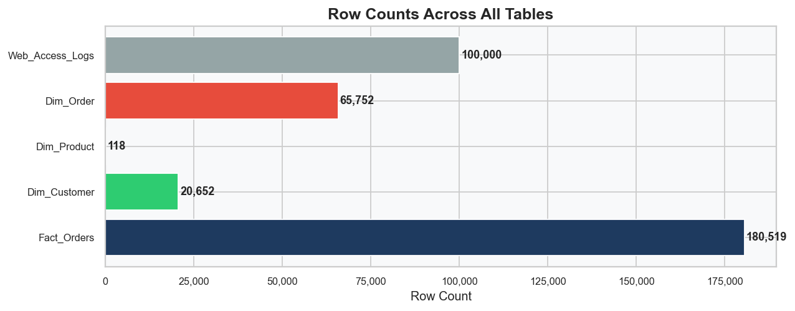

---

### Section 2 — Sales & Revenue

**EDA 03 — Monthly Sales and Profit Trend**
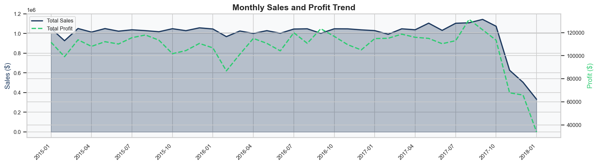

**EDA 04 — Year-over-Year Performance**
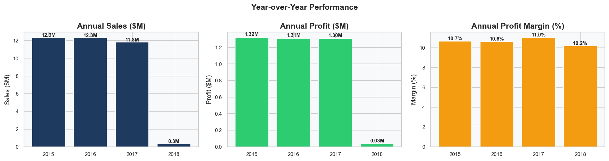

---

### Section 3 — Customer Analysis

**EDA 05 — Market Performance Overview**
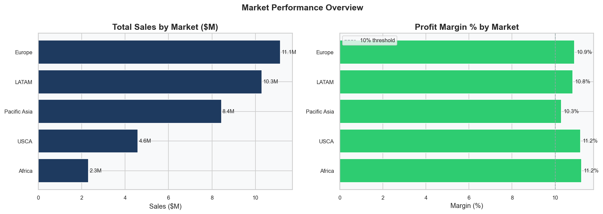

**EDA 06 — Customer Segment Analysis**
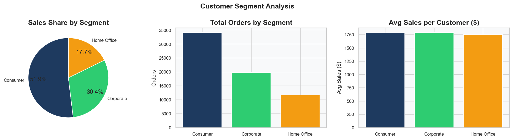

**EDA 07 — RFM Customer Segmentation**
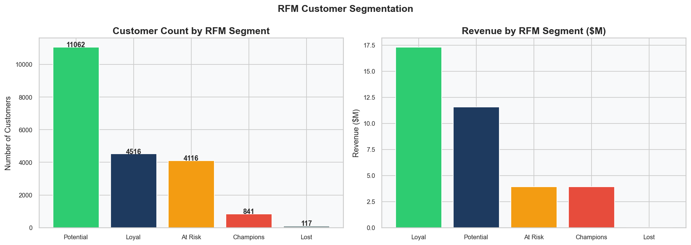

---

### Section 4 — Product Performance

**EDA 08 — Product Performance Leaders**
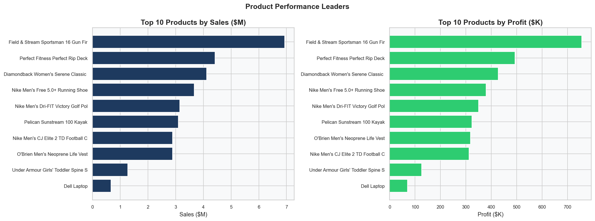

**EDA 09 — Department-Level Analysis**
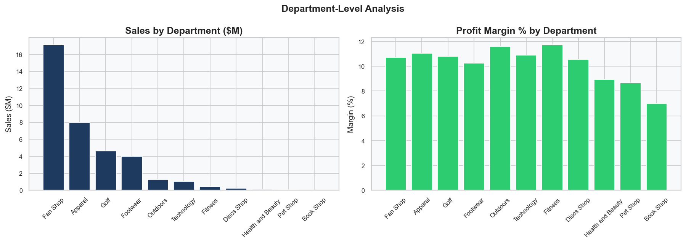

**EDA 10 — Discount Impact on Profitability**
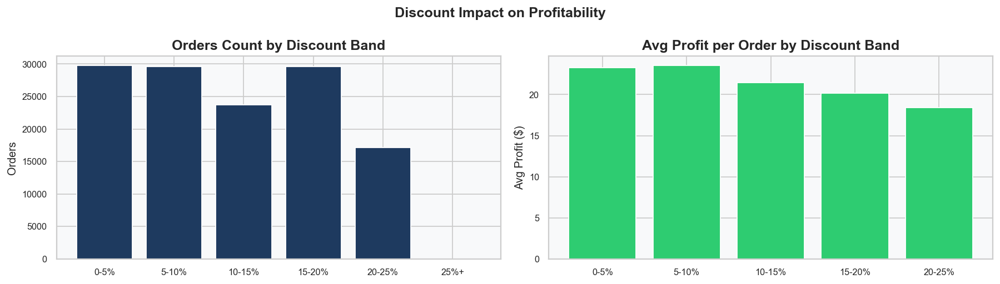

---

### Section 5 — Logistics & Delivery

**EDA 11 — Shipping Mode Performance**
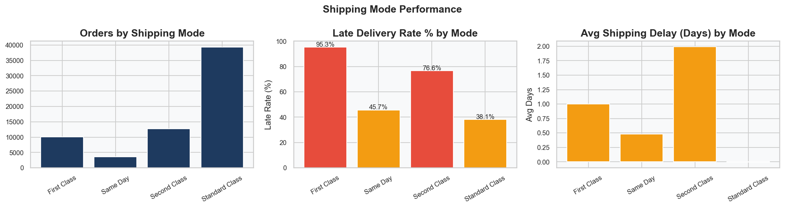

**EDA 12 — Delivery Status & Regional Risk**
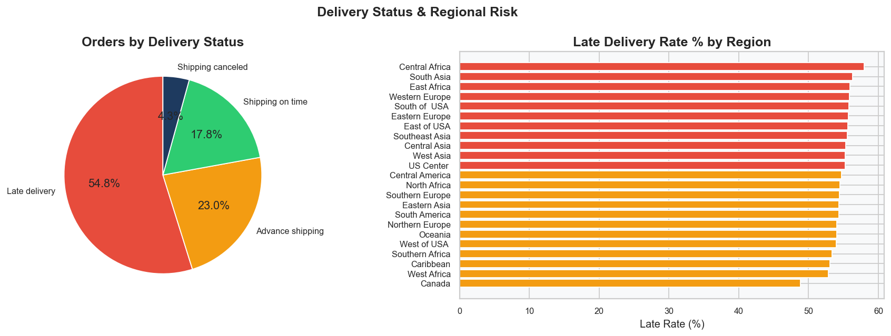

---

### Section 6 — Geography

**EDA 14 — Geographic Performance**
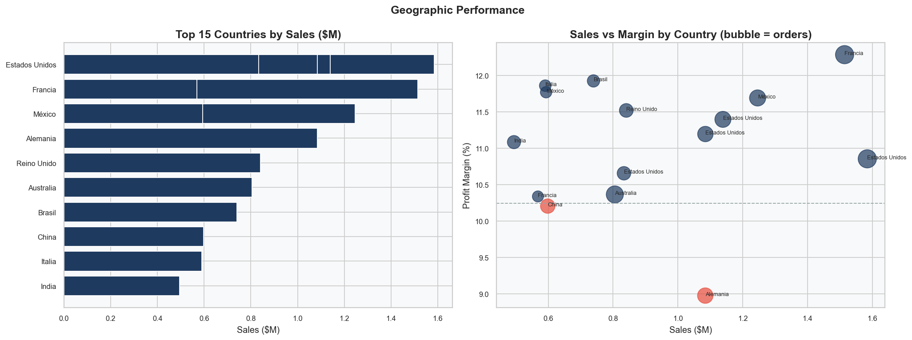

---

### Section 7 — Web Access Logs

**EDA 15 — Web Access Log Insights**
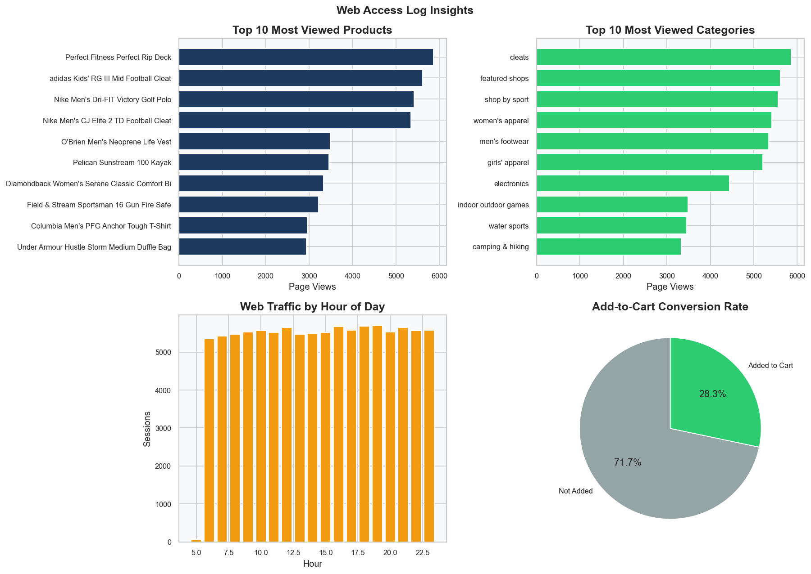

---

### Section 8 — Statistical Analysis

**EDA 17 — Correlation Matrix**
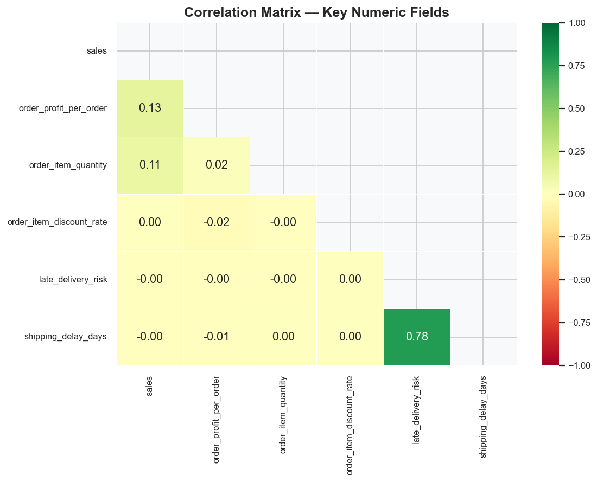

---

## EDA Key Findings Summary

| Chart | Key Finding |
|---|---|
| EDA_01 | 180K orders · 65K unique orders · 100K web log sessions |
| EDA_03 | Revenue stable $1M/month 2015–2017; sharp Q1 2018 drop (partial year) |
| EDA_04 | Sales: $12.3M (2015), $12.3M (2016), $11.8M (2017), $0.3M (2018 partial) |
| EDA_05 | Europe leads sales ($11.1M); USCA & Africa highest margin (11.2%) |
| EDA_06 | Consumer 51.9% · Corporate 30.4% · Home Office 17.7% |
| EDA_07 | 11K Potential · 4.5K Loyal · 4.1K At-Risk · 841 Champions · 117 Lost |
| EDA_08 | Field & Stream Sportsman 16 Gun Fire Safe = #1 product by sales & profit |
| EDA_09 | Fan Shop dominates ($17M); Book Shop lowest margin (7%) |
| EDA_10 | Higher discounts slightly reduce avg profit per order |
| EDA_11 | First Class: 95.3% late rate; Same Day: 45.7% (best performance) |
| EDA_12 | 54.8% late delivery; Central Africa & South Asia highest risk regions |
| EDA_14 | Estados Unidos & Francia top countries; Alemania below-margin outlier |
| EDA_15 | 28.3% add-to-cart rate; Cleats & Featured Shops most viewed categories |
| EDA_17 | Shipping delay & late delivery risk strongly correlated (0.78) |

---

## Quick Start

### 1. Clone the Repository
```bash
git clone https://github.com/MohamedEl-sadek/SMART-Supply-Chain-Insights-Dashboard.git
cd SMART-Supply-Chain-Insights-Dashboard
```

### 2. Install Python Dependencies
```bash
pip install pandas numpy openpyxl pyodbc matplotlib seaborn
```

### 3. Set Your Data Path
In each Python script, update:
```python
BASE_DIR = r"D:\SMART-Supply-Chain-Insights"
```

### 4. Run the Pipeline

```bash
# Step 1: Clean data and build Excel with 6 Star Schema sheets
python python/clean_and_merge.py

# Step 2: Load Excel into SQL Server
python python/load_to_sqlserver.py

# Step 3: Generate 19 EDA charts
python python/EDA_SupplyChain_Report.py
```

### 5. SQL Server Setup
```sql
USE SupplyChainDW;
SELECT TABLE_NAME, TABLE_TYPE FROM INFORMATION_SCHEMA.TABLES;
```

### 6. Open Power BI
1. Open `powerbi/SupplyChain_Analysis.pbix`
2. Update the connection to `(localdb)\MSSQLLocalDB` → `SupplyChainDW`
3. Refresh — all 6 tables load automatically

---

## SQL Server Connection

```
Server:   (localdb)\MSSQLLocalDB
Database: SupplyChainDW
Driver:   ODBC Driver 18 for SQL Server
Auth:     Windows Authentication
```

---

## Author

**Mohamed El-Sadek**
- GitHub: [@MohamedEl-sadek](https://github.com/MohamedEl-sadek)
- Project: SMART Supply Chain Insights Dashboard

---

*Built with Python · SQL Server · Power BI*
